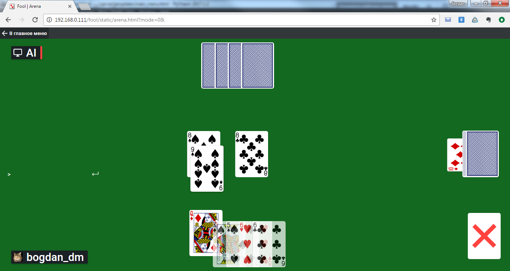

# Браузерная игра "Дурак"

Карточная браузерная игра на базе Flask и HTML5 (Дипломный проект)

Возможности:

1. Игра против компьютера (ИИ)
2. Игра против другого игрока в сети (случайный поиск среди других игроков, находящихся в ожидании)
3. Внутриигровой чат, для переписки во время игры
4. Список друзей и управление им. Поддержка состояния онлайн/оффлайн для списка друзей
5. Отправка друзьям приглашения на матч
6. Страница администратора с информацией для отладки и пр.

Технологии:
* фрэймворк Flask (Python)
* MySql
* HTML5
* Server Sent Events
* jQuery

